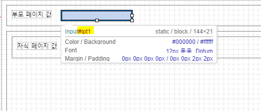
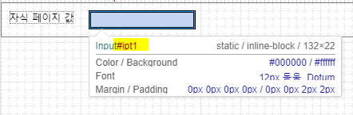
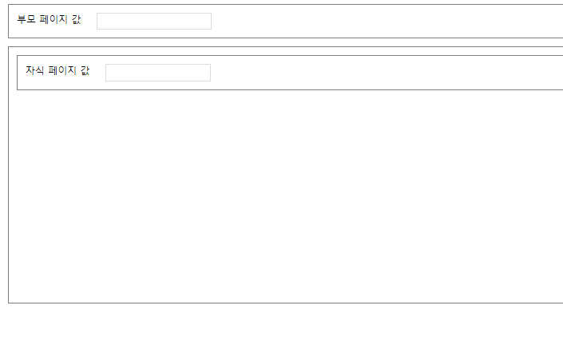
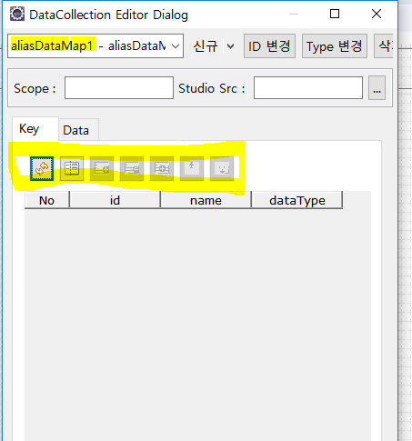
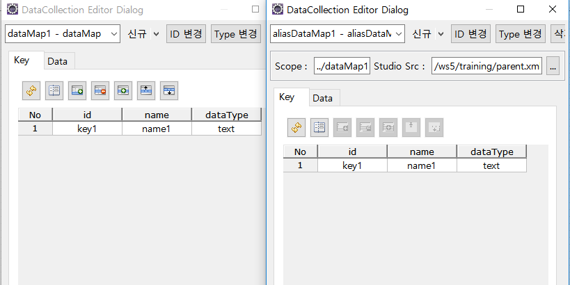
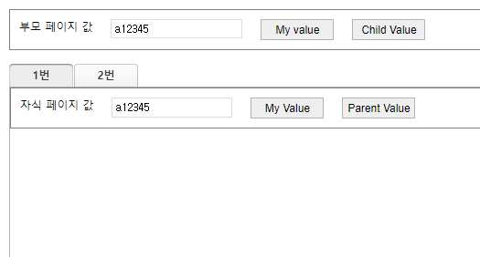
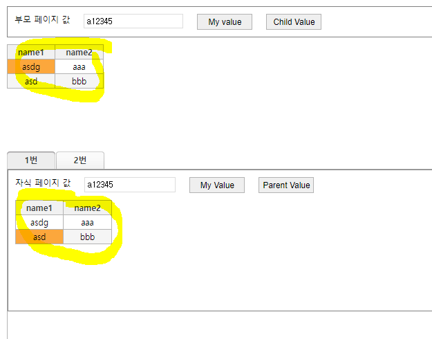

# WebSquare5 배워보기 - 고급 과정

✍️ *Written by Yunju Jang*

 🚩*2021.09.07*

## 4. WFrame

#### 4-1) WFrame 이란?

- File을 include하는 개념
- IFrame 처럼 부모 - 자식 페이지가 독립된 영역으로 나뉘는 것이 아니라, 부모 페이지와 하나의 영역 내에 구성되는 것이다.

<br/>

<br/>

#### 4-2) WFrame 방식의 장단점

- 장점
  - 부모 페이지와 함께 하나의 웹 페이지로 구성되기 때문에 IFrame에 비해 적은 메모리를 사용한다.
  - 적은 메모리 사용으로 보다 빠른 속도로 화면을 렌더링할 수 있다.

<br/>

- 단점
  - 부모 페이지의 구성요소와 동일한 id를 갖는 컴포넌트가 있을 경우 id 중복 문제가 발생한다.
    - <b>이 중복을 피하기 위해 <mark>scope</mark>라는 기능을 사용할 수 있다.</b>

<br/>

<br/>

#### 4-3) WFrame의 Scope 속성

- 
- 
- 
  - 위와 같이 부모와 자식에서 동일한 id를 사용해도 에러 없이 정상적으로 작동된다.
  - scope라는 속성이 적용되었기 때문이다.
    - 실제 화면에서 rendering되는 id를 변경하는 속성이다.
    - scope 속성은 true가 default이다.
  - tabControl에서 tab을 2개로 구성하면 default로 WFrame에 scope가 적용된다.
    - 두개의 tabContent 안에 부모 id와 같은 id를 가진 동일한 자식 페이지를 적용하여도 에러가 발생하지 않는다.
    - 브라우저의 요소 검사를 통해 렌더링된 id를 보면 지정한 id가 아닌 각기 다른 id로 렌더링되었기 때문이다.
  - 렌더링 시 자동으로 다른 id를 부여하지만, script 작성 시 렌더링된 id가 아닌 <b>원래 id를 사용</b>하면 된다.
    - 자신의 page 내에 있는 componenet를 접근하는 것이기 때문에

<br/>

<br/>

#### 4-4) 부모 페이지에서 자식 페이지의 컴포넌트를 접근하는 방법

- getWindowAPI 사용

  - 단순 WFrame이나 WFrame을 이용한 tabControl, windowContainer 등은 하위 객체 접근 시 이 API를 사용한다.

    ``` javascript
    /* getWindow API 사용 예시 */
    scwin.btn_childValue_onclick = function(e){
        // 1. 첫번째 화면의 inpt1에 접근, index로 구현
        alert(t1.getWindow(0).ipt1.getValue()); // 0번째 index
        
        // 2. 선택된 탭 인덱스 하위의 ipt1 객체에 접근
        alert(t1.getWindow(t1.getSelectedTabIndex()).ipt1.getValue()); // tab들 중 선택된 tab의 인덱스를 가져와 getWindow의 인자로 넘겨줌
    };
    ```

<br/>

<br/>

#### 4-5) 자식 페이지에서 부모 페이지의 컴포넌트를 접근하는 방법

- $p.parent() 사용

  - WFrame의 scope가 적용된 경우 상위 객체에 접근할 때에는 parent에 바로 접근하지 않는다. (IFrame과의 차이)

    ``` javascript
    /* $p.parent() 사용 예시 */
    scwin.btn_parent_onclick = function(e){
        alert($p.parent().ipt1.getValue());
    };
    ```

<br/>

<br/>

#### 4-6) AliasDataMap / AliasDataList

- AliasDataMap

  - 부모 페이지에 바인딩된 dataMap

  - 이 dataMap을 자식 페이지에서 접근할 때 AliasDataMap을 생성해서 사용한다.

  - AliasMap은 직접 데이터를 추가할 수 없다.

    

  - 부모 페이지에서 생성한 DataMap을 접근하기 위해 속성을 사용한다.

    - scope 속성 : 접근하고자 하는 상위 객체의 DataMap 경로를 지정한다.
    - studioSrc : 자식 페이지에서 바라보는 부모 페이지를 지정한다.

  - 부모 페이지의 dataMap에서 적용한 항목과 test data 모두 확인할 수 있다.

    

  - 부모 페이지나 자식 페이지에서 값을 바꿔도 두 곳 다 동일하게 적용된다.

    

  <br/>

- AliasDataList

  - 부모페이지에 dataList와 gridView를 만들어 바인딩한다.

  - 자식 페이지에서도 gridView와 AliasDataList를 생성하여 바인딩한다.

  - 마찬가지로 gridView의 내용이 바뀌어도 부모 - 자식 간에 동일하게 반영된다.

    
