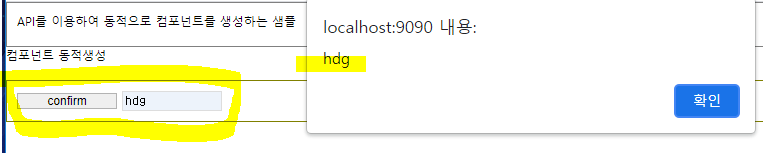

# WebSquare5 배워보기 - 고급 과정

✍️ *Written by Yunju Jang*

 🚩*2021.09.07*

## 5. 동적 컴포넌트 생성

#### 5-1) $p.dynamicCreate API 사용

- 동적으로 컴포넌트를 생성할 때 사용한다.
  - ex) 동적으로 버튼 또는 input 생성
- 파라미터 정리
  - 첫번째 인자 : 생성될 컴포넌트의 Id
  - 두번째 인자 : 생성될 컴포넌트의 종류
  - 세번째 인자 : 생성될 컴포넌트의 속성
  - 네번째 인자 : 생성될 컴포넌트의 Parent Object Id

<br/>

- 예제

  ``` javascript
  // 1, 버튼을 누르면 btn_confirm 이라는 'trigger'를 동적으로 생성
  	// 해당 컴포넌트에 'confirm'이라는 값 넣기
  scwin.btn_createBtn_onclick = function(e) {
      $p.dynamicCreate( // trigger 생성
      	"btn_confirm", // id
          "trigger", // 종류
          {
              style : "width:100px; height:20px; margin-right:5px;"
          }, // 속성
          grpParent // 생성할 object의 부모 id
      );
      
      btn_confrim.setValue("confirm"); // 생성한 trigger에 label 추가
  };
  ```

  ``` javascript
  // 2. 버튼을 누르면 inptTest라는 'input'을 동적으로 생성
  scwin.btn_createInput_onclick = function(e){
      $p.dynamicCreate( // input 생성
      	"inptTest", // id
          "input", // 종류
          { // 속성
              style : "width:100px; height:20px; margin-right:5px;"
          },
          grpParent // 생성할 object의 부모 id
      );
  };
  ```

  

<br/>

#### 5-2) bind API 사용

- 동적으로 생성한 컴포넌트에 이벤트를 적용한다.

- 파라미터 정리

  - 첫번째 인자 : 적용할 event
  - 두번째 인자 : 실행될 function 정의

  <br/>

- 예제

  ``` javascript
  // 3. 생성된 input에 onclick을 추가하여, 생성한 버튼을 누르면 alert창 띄우기
  scwin.btn_createInput_onclick = function(e){
      $p.dynamicCreate(
      	"inptTest",
          "input",
          { 
              style : "width:100px; height:20px; margin-right:5px;"
          },
          grpParent
      ); // 여기까지 위와 동일
      
      btn_confirm.bind("onclick", function() {
          alert(inptTest.getValue());
      }); // 생성한 버튼을 누르면 생성한 input의 값을 alert 창에 뿌려주는 event
  };
  ```

  

