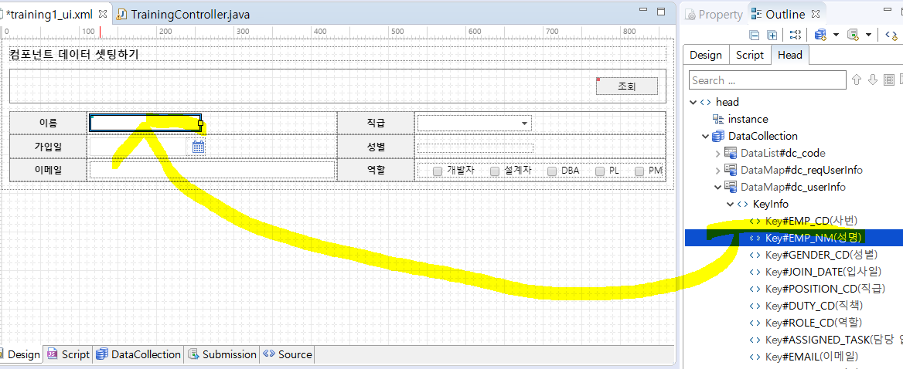
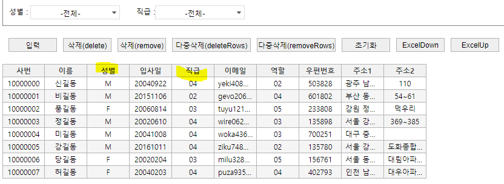
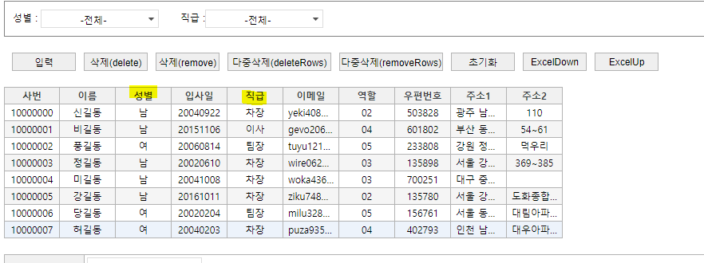

# WebSquare5 배워보기 - 개발자 과정

✍️ *Written by Yunju Jang*

 🚩*2021.09.03*

## 4. 데이터 통신하기

#### 4-1) 데이터 통신 방법

- <b>Submission에서 통신을 만들어 사용</b>

  - ID : 통신의 이름
  - Reference : 화면에서 초기값을 Servlet으로 던져주기 위한 DataCollection
  - Target : Servlet에서 화면으로 값을 던져주기 위한 DataCollection
    - 위 두 DataCollection은 사전에 만들어져있어야 하며, 이와 엮어준다.
  - URL Action : 결과를 처리하는 경로 (Servlet 정보)
  - Process Message : 처리중이라는 문구 등을 작성한다. Progress Bar도 제공한다.
  - <mark>submit</mark> : 처리 Servlet 구동 직전 (통신 직전)에 마지막으로 화면에서 수행되는 스크립트 함수 (ex. 초기값 처리, validation 체크 등)
  - <mark>submit-done</mark> : 통신이 끝난 후 가장 먼저 화면에서 수행되는 함수
  - <mark>submit-error</mark> : 통신 중 에러가 발생했을 때 가장 먼저 화면에서 수행되는 함수

   

- 통신 중에는 버튼을 disable 시킬 수 있다.

  - 충돌을 방지하기 위함

 

 

#### 4-2) 단건의 데이터 받아오기

- 보내는 DataCollection은 DataMap으로 만든다.

  - 단건의 데이터를 보내기 때문에 (ex. 검색할 사원의 사번)

- 받아오는 DataCollection도 DataMap으로 만든다. (ex. 해당 사원 한명에 대한 정보)

  \* 텍스트 파일 등에서 tab으로 구분된 데이터들은 붙여넣기 할 경우 알아서 반영된다.

- Submission 정보에 위의 두 DataCollection과 서블릿 경로를 매핑한다.

 

- <b>보내기</b>
  - 언제 요청할 것인지 기술한다.
    - ex. 조회 버튼을 눌렀을 경우
    - 조회 버튼에 onclick 이벤트를 달고, 해당 부분 script에 executeSubmission 유틸성 메소드를 활용한다.
      - Reference를 이용할 경우 이 부분은 생략이 가능하다.

 

- <b>받아오기</b>

  - 받은 데이터를 컴포넌트에 표현하기 위해 Reference를 건다.

    - DataCollection의 key ID 와 그에 해당하는 각각의 컴포넌트를 매핑한다.

    - DataCollection에서 컴포넌트로 drag&drop을 통해 매핑할 수 있다.

      

    - 이렇게 Reference를 사용할 경우 script 코딩을 현저히 줄일 수 있다.

 

 

 

#### 4-3) 다건의 데이터 받아오기

##### 그리드 뷰

- 대량의 데이터를 가져다가 각각의 컬럼에 다양한 타입으로 표현해주는 컴포넌트
- 데이터 리스트가 준비되어야 하고, 그리드 뷰는 이것을 디스플레이하는 역할만 한다.
  - 즉, 가지고 온 데이터 리스트를 그리드 뷰라는 컴포넌트에 표현하는 것이다.

 

##### 그리드 뷰를 사용하는 다양한 방법

- 그리드 뷰를 선택하고 dataList 속성에서 준비한 dataCollection과 엮어준다.
- 그리드 뷰의 각각의 cell의 id 속성에 엮여진 dataList의 각각의 id를 넣어 컴포넌트에 표현한다.
- 그리드 뷰를 편집할 때에는 좌측 상단의 열/행 추가를 이용한다.
  - 또는 그리드 뷰 전체를 더블 클릭하면 한번에 수정이 가능하다.
- dataList를 그리드 뷰에 드래그 앤 드롭하면 dataList의 구조대로 바인딩 해준다.
- 그리드 뷰에서 하나의 column을 삭제해도, 데이터 구조 상에는 남아있다.
  - 따라서 데이터 손상 없이 보고 싶은 데이터만 가볍게 볼 수 있다.

 

 

##### 그리드 뷰의 속성

- inputType

  - 그리드 뷰의 각각의 cell은 inputType 속성을 이용하여 타입을 변경할 수 있다.

    - ex. 코드로 나왔던 데이터를 코드 이름으로 출력

      

      

   

- autoFit

  - 그리드 뷰를 브라우저의 크기와 데이터의 길이에 맞게 사용할 수 있다.
    - lastColumn : 마지막 column에게 여백을 몰아준다.
    - allColumn : 각각의 column이 남은 여백을 골고루 나눠 가진다.
  - autoFitMinWidth
    - 그리드 뷰의 최소 크기
    - 브라우저의 너비가 아무리 좁아도 데이터가 잘리지 않고 다 보여질 수 있도록 가로 스크롤이 생긴다.

   

- rowNumVisible

  - true로 설정하면 데이터들의 순번을 보여준다.

   

- sortable

  - 정렬하고 싶은 cell 또는 그리드 뷰 전체를 잡아 true로 설정하면 원하는 cell을 기준으로 정렬이 가능하다.
    - 그리드 뷰 전체에 이 속성을 걸어줬을 경우, 화면에서 원하는 cell을 더블 클릭하여 그를 기준으로 정렬할 수 있다.
    - 한가지 cell을 더블 클릭하여 선택하고, ctrl 키를 이용해 다른 cell을 추가하면 multi sorting이 가능하다.

   

- useFilter

  - 보고싶은 데이터를 골라서 보고싶을 경우에 사용한다.
  - 필터를 걸고 싶은 cell의 header를 클릭하여 true로 설정한다.
  - useFilterList
    - 위의 상태에서 추가로 전체 그리드 뷰를 잡아 이 속성을 true로 설정하면 체크 콤보 박스로 필터 조정이 가능하다.

   

- columnMove

  - 원하는 column의 header를 잡아 끌면 이동이 가능하다.

 

 

##### master와 detail 구조

- 그리드 뷰에 조회된 row들 중 하나를 골라 column 별로 하단의 컴포넌트에 기재하고 싶을 때 사용한다.
- 기존의 WebSquare의 경우 해당 row의 데이터들을 dataMap으로 받아 컴포넌트에 reference를 걸어주었다.
  - WebSquare5 sp4의 경우 Map, List 상관 없이 reference를 걸 수 있다.
  - 이미 dataCollection이 List로 존재하기 때문에 굳이 하나 더 생성할 필요 없게된다.
- detail에서 값이 수정되면 master에도 반영된다.
- detail에 항목을 추가할 경우
  - 기존 방식 - detail의 영역 (행 또는 열) 을 직접 추가하고 그 안에 컴포넌트 생성 후, 해당하는 data를 reference 걸어준다.
  - sp4 - 영역을 추가하고 비어있는 영역에 drag & drop을 통해 reference를 걸면 header와 컴포넌트가 자동으로 생성되며 reference도 걸리게 된다.
